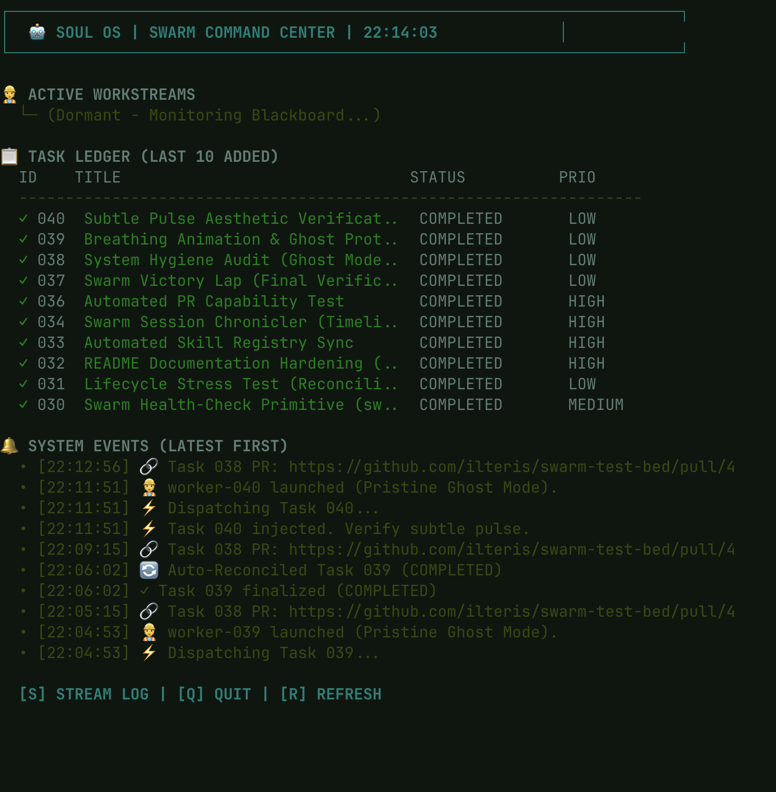

# Actor-Orchestrator: Agentic Swarm Infrastructure

A "Unix-for-AI" architecture for managing concurrent, autonomous agent workstreams using `gemini-cli` and `zmx`.



## What is it?
The Actor-Orchestrator is a hierarchical agentic system that transforms a flat `TODO.md` file into an active project blackboard. It uses an **Actor Model** pattern to delegate tasks to isolated sub-agents (Workers) that operate in their own persistent terminal sessions, managed by a high-fidelity TUI Command Center.

## The Vision: High-Fidelity Autonomy
- **Cognitive Multiplier**: Offload high-throughput implementation to parallel agents while maintaining high-level architectural oversight.
- **Physical Isolation**: Each worker runs in its own `zmx` session with unique temporary workspaces, preventing file-system conflicts and logical crosstalk.
- **Observability**: A dedicated **Swarm Command Center** provides real-time "Active Reasoning" previews, event logging (PR detection), and interactive "Jack-In" capabilities.
- **Self-Healing**: Automated reconciliation loops detect dead workers, audit logs for completion signatures, and update task states without human intervention.
- **Ghost Protocol**: Hermetic execution runners that self-destruct upon completion, leaving the system temporary directories pristine.

## The Hierarchy
1.  **Meta-Orchestrator (Teddy)**: Bootstraps the environment and launches the Supervisor.
2.  **Supervisor Actor**: Monitors the `.tasks/` directory and `TODO.md` blackboard; delegates tasks via a deterministic dispatch engine.
3.  **Worker Actors**: Distributed engineers that execute specific tasks (Clone -> Branch -> Implement -> Verify -> Commit -> PR).

## Command Center Interface
- **Active Workstreams**: Displays live reasoning and "thoughts" from running workers with a subtle pulsating heartbeat.
- **Task Ledger**: A recency-sorted list of the latest 10 tasks and their current states.
- **System Events**: A descending feed of infrastructure events, including automated PR link capture.
- **Interactivity**: 
    - `[S]` **Stream Log**: Focus on a specific worker's full log output.
    - `[R]` **Refresh**: Force a data re-sync.
    - `[Q]` **Quit**: Graceful, silent exit.

## S5 Protocol (Atomic Contribution)
All workers follow a strict Git lifecycle:
1.  Isolation in a dedicated branch: `task-<ID>-<slug>`.
2.  Implementation and local verification.
3.  Automatic push to remote and Pull Request creation via GitHub CLI (`gh`).
4.  URL reporting back to the master Command Center.

---

## Installation & Setup
Ensure you have the core dependencies installed:
```bash
# Install zmx (The persistent terminal layer)
brew tap neurosnap/tap && brew install zmx

# Install gemini-cli (The agent logic)
brew install gemini-cli

# Pre-authorize tools in ~/.gemini/settings.json
# Ensure "run_shell_command", "write_todos", "read_file", "list_files", "delegate_to_agent" are allowed.
```

### Launching a Swarm
1.  **Link the Extension**:
    ```bash
    cd ~/Code/actor-orchestrator && gemini extensions link .
    ```
2.  **Activate Mission Control**:
    Inside any project with a `.tasks/` directory or `TODO.md`:
    ```bash
    ./../actor-orchestrator/commands/swarm-launch
    ```

## Technical Specs
- **State Engine**: `.tasks/*.json` (Individual task metadata).
- **Communication**: Shared `swarm.log` + synchronous tool returns.
- **Runtime**: Python 3.x (Dashboard) + Bash (Runners) + Gemini CLI (Agents).