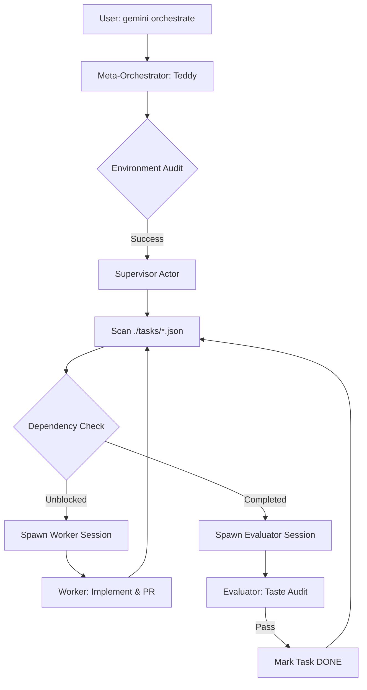

# Actor-Orchestrator: Agentic Swarm Infrastructure

A "Unix-for-AI" architecture for managing concurrent, autonomous agent workstreams using `gemini-cli` and `zmx`.

## 🎯 What is it?
The Actor-Orchestrator is a hierarchical agentic system that transforms a project directory into an active **Blackboard**. It uses an **Actor Model** pattern to delegate tasks to isolated, ephemeral sub-agents (Workers) that operate in persistent terminal sessions.

## 🛠 Why use it?
- **Cognitive Multiplier**: Offload implementation "slop" to parallel agents while maintaining high-level architectural oversight.
- **Physical Isolation**: Each worker runs in a unique `zmx` pane with an isolated temporary workspace (`/tmp`), preventing file-system conflicts and logical crosstalk.
- **Self-Purifying**: The **Reaper Protocol** automatically prunes sessions and workspaces upon completion, ensuring zero resource leakage.
- **Observability**: A zero-flicker, 3-pane **Mission Control** TUI provides a "Commander's View" of the entire swarm's state and telemetry.

## 🏗 How it Works (The Flow)



---

## 🚀 Installation & Setup

### 1. Prerequisites
Ensure you have the core persistent terminal layer and the Gemini CLI installed:
```bash
# Install zmx (Persistent Terminal Layer)
brew tap neurosnap/tap && brew install zmx

# Install gemini-cli
brew install gemini-cli
```

### 2. Install Extension
Link the orchestrator directly from the repository:
```bash
gemini extensions install https://github.com/ilteris/actor-orchestrator.git
```

---

## 🕹 Usage Guide

### 1. Initialize the Blackboard
Create a `./tasks/` directory in your project root and add task JSON files:
```json
{
  "id": "001-setup",
  "title": "Initial Project Setup",
  "status": "pending",
  "contract": "architect",
  "blocked_by": []
}
```

### 2. Launch the Swarm
To start the orchestration with the 3-pane Mission Control view:
```bash
gemini --yolo "orchestrate this project"
```

To run a background swarm (Headless Mode):
```bash
gemini --yolo "orchestrate this project silently"
```

### 3. Control & Observability
- **Pause Swarm**: `touch .pause`
- **Resume Swarm**: `rm .pause`
- **Kill Switch**: `swarm-kill`
- **Reaper**: `swarm-reaper` (Manual deep clean)

---

## 🛡 Technical Specs
- **State Engine**: `./tasks/*.json` (Single Source of Truth)
- **Isolation**: `./tmp/<task_id>/`
- **Persistence**: `zmx` session management.
- **UI**: Zero-flicker Modular Pane Architecture.

---
*Created by Teddy (The Distributed Soul) for Sir.*
