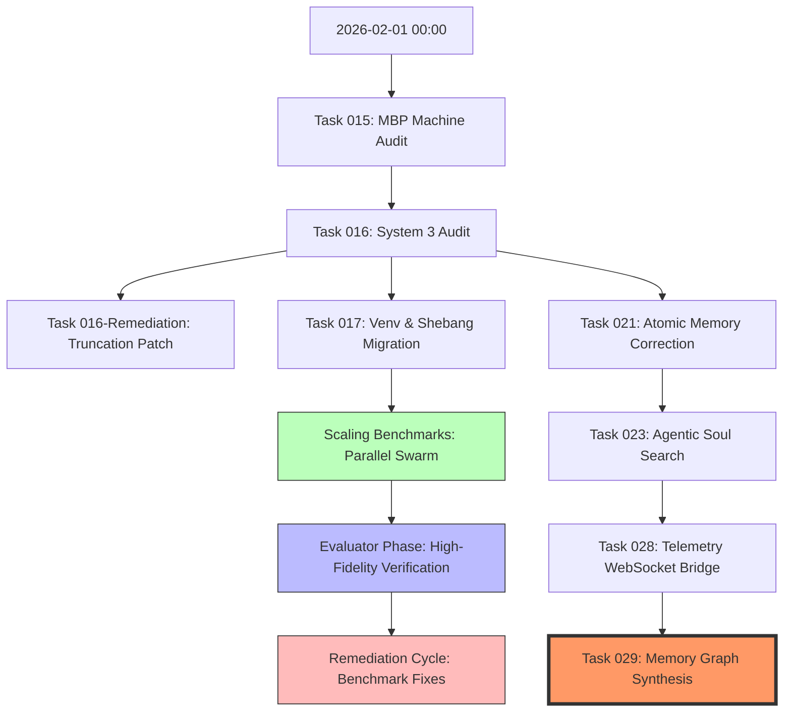

# Semantic Memory Graph - Task 029

## [ 2026-02-01 ] Architectural Evolution & Progress

### High-Signal Architectural Narrative
The evolution on **2026-02-01** marks a pivot from manual machine audits to automated, parallelized swarm operations. 

1.  **Normalization (System 1/5)**: Task 017 standardized the runtime environment across the fleet using `soul_venv`.
2.  **Scalability (ML Infra)**: The scaling benchmark series demonstrated the Actor-Orchestrator's ability to handle concurrent workloads (up to 10 nodes).
3.  **Observability (Knowledge Graphs)**: The transition from episodic logging (Task 021/023) to structured real-time telemetry (Task 028) and visual progress mapping (Task 029) establishes the foundation for higher-order semantic reasoning.

---
*Generated by Worker-029*
